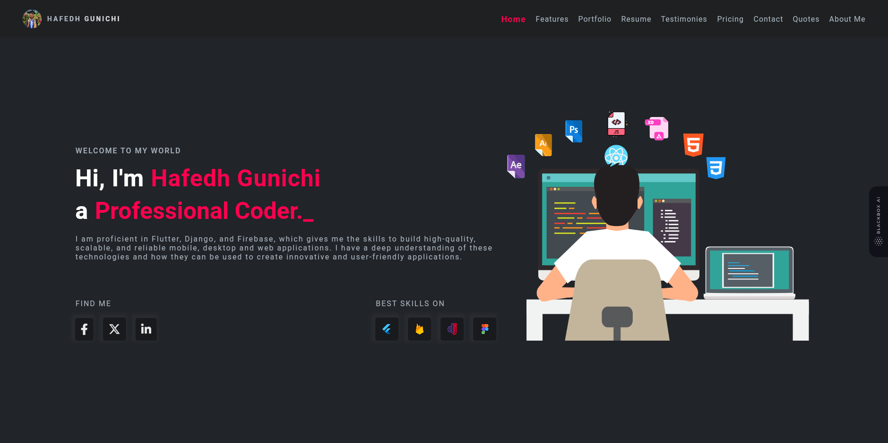
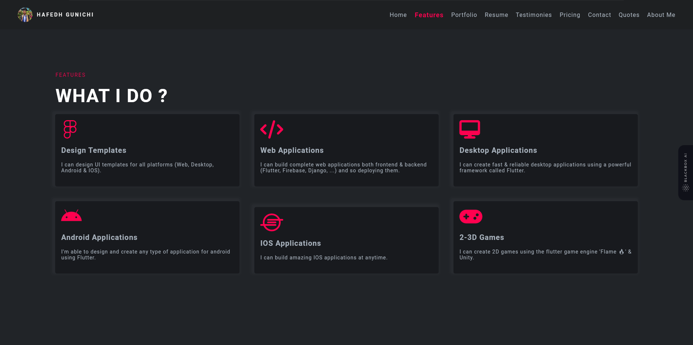
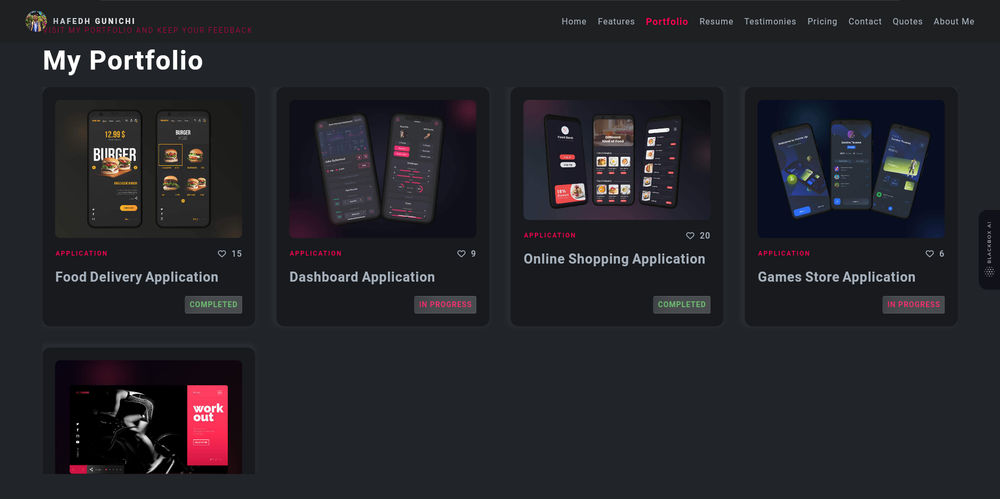
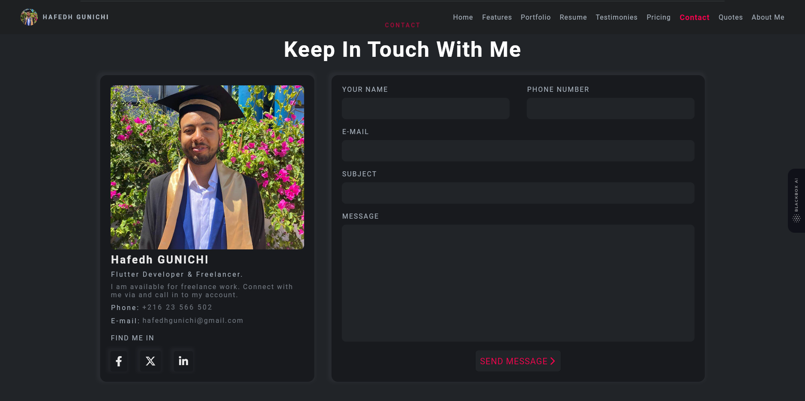
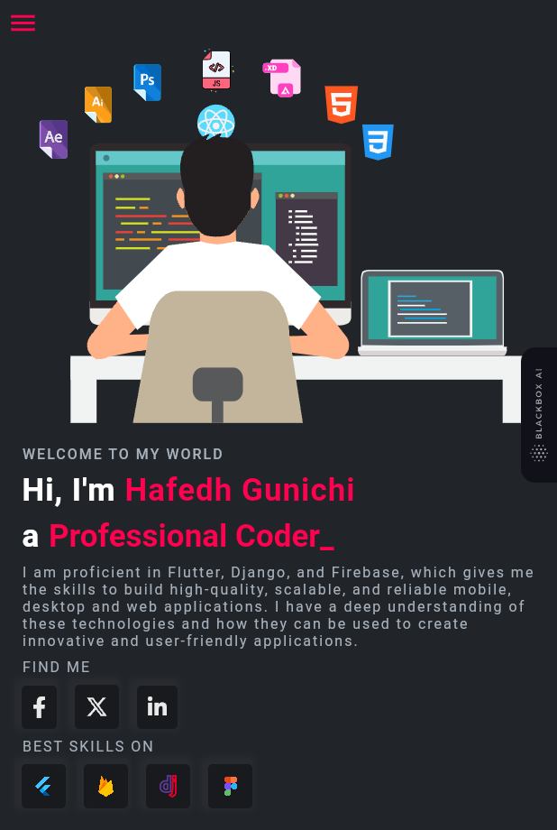
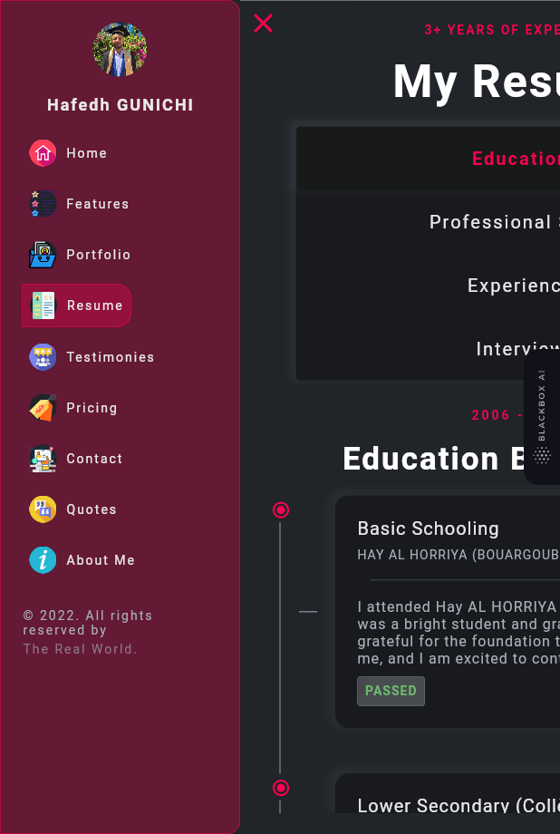
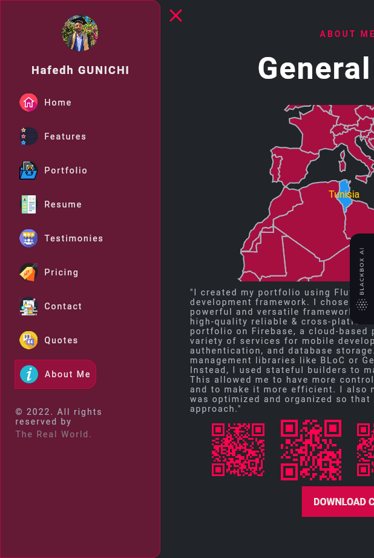

# Professional Website

Welcome to my professional website repository! This website showcases my portfolio, skills, and experiences.

## Overview

This website serves as a platform to display my professional profile, projects, and achievements. It's designed to provide visitors with an insight into my expertise and the services I offer.

## Features

- **Portfolio**: View my showcased projects, including descriptions, technologies used, and links to live demos or repositories.
- **About Me**: Learn about my background, skills, experiences, and interests.
- **Contact**: Reach out to me through the provided contact information or the contact form available on the website.
- **Blog (optional)**: Share insights, tutorials, or experiences related to my professional field.

## Technologies Used

- **Frontend**: HTML, CSS, JavaScript, React (or any other front-end library/framework used).
- **Backend**: (If applicable) Node.js, Express.js, MongoDB (or any other backend technology used).
- **Deployment**: Hosted on GitHub Pages, Netlify, Vercel, or other hosting platforms.

## Getting Started

To run this project locally, follow these steps:

1. Clone the repository.
2. Navigate to the project directory.
3. Open the `index.html` file or start a local server if applicable.

## Usage

Feel free to use this project as a template for your own professional website. Customize it with your information, projects, and style to create your unique online portfolio.

## Contributing

Contributions, issues, and feature requests are welcome! If you'd like to contribute, please create a pull request or open an issue.

## License

This project is licensed under the [MIT License](LICENSE).

  
  
  
  
  
  
  

